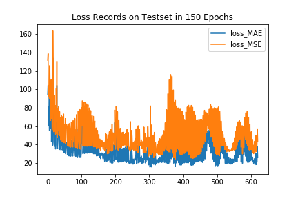

# SANet-Keras
> Unofficial implementation of SANet for crowd counting in Keras.

---

## Paper:

+ Original_paper: [_Cao, X., Wang, Z., Zhao, Y., & Su, F. (2018). Scale Aggregation Network for Accurate and Efficient Crowd Counting. *The European Conference on Computer Vision (ECCV)*, 1–17_](http://openaccess.thecvf.com/content_ECCV_2018/html/Xinkun_Cao_Scale_Aggregation_Network_ECCV_2018_paper.html).

### Results now:

*On dataset ShanghaiTech B*

> Still far from the performance in the original paper(MAE 8.6)

|  MAE   |  MSE   |  MAPE  | Mean DM Distance |
| :----: | :----: | :----: | :--------------: |
| 13.821 | 22.223 | 12.140 |     110.750      |

### Dataset:

- **ShanghaiTech dataset**: [dropbox](<https://www.dropbox.com/s/fipgjqxl7uj8hd5/ShanghaiTech.zip?dl=0>) or [Baidu Disk](<http://pan.baidu.com/s/1nuAYslz>).

### Training Parameters:

1. *Loss* = ssim_loss + L2

2. *Optimizer* = Adam(lr=1e-4)

3. *Data augmentation*: Flip horizontally.

4. *Patch*: No patch, input the whole image, output the same shape DM.

5. *Instance normalization*: No IN layers at present, since network with IN layers is very hard to train and IN layers didn't show improvement to the network in my experiments.

6. ***Output Zeros***: The density map output may fade to zeros in 95%+ random initialization, I tried the initialization method in the original paper while it didn't work. In the past, when this happens, I just restarted the kernel and re-run. But now, I tried to train different modules(1-5) separately in the first several epochs to get relatively reasonable weights:

   , and it worked out to greatly decrease the probability of the zero-output-phenomena. Any other question, welcome to contact [me](zhengpeng0108@gmail.com).

7. *Weights*: Got best weights in epoch271(405 epochs in total), and here is the loss records:

   

8. *Prediction example*:

   

### Run:

1. Download dataset;
2. Data generation: run the`generate_datasets.ipynb `.
3. Run the `main.ipynb` to train the model and do the test.

#### Abstraction:

1. **Network = encoder + decoder**, model plot is [here](./images/SANet_noIN.png):

   

   |   Network   |           encoder            |               decoder                |
   | :---------: | :--------------------------: | :----------------------------------: |
   | Composition |   scale aggregation module   |           conv2dTranspose            |
   |    Usage    | extract multi-scale features | generate high resolution density map |

2. Loss:

   Loss = }},\alpha_C=0.001))

3. Normalization layer:

   + Ease the training process;
   + Reduce 'statistic shift problem'.