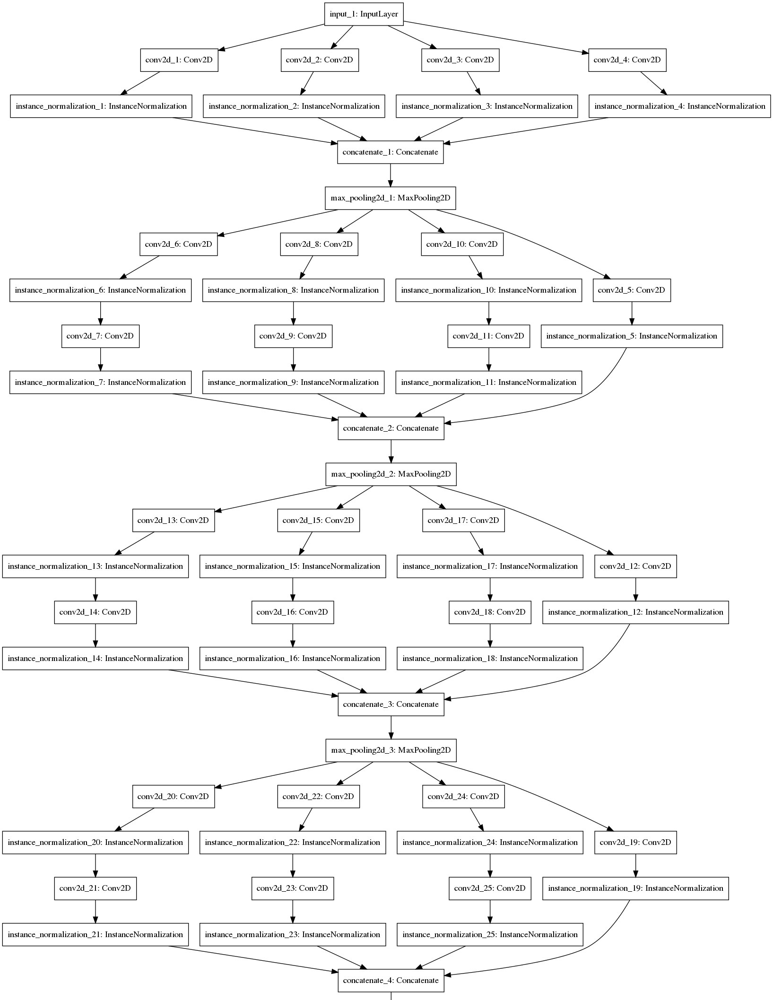
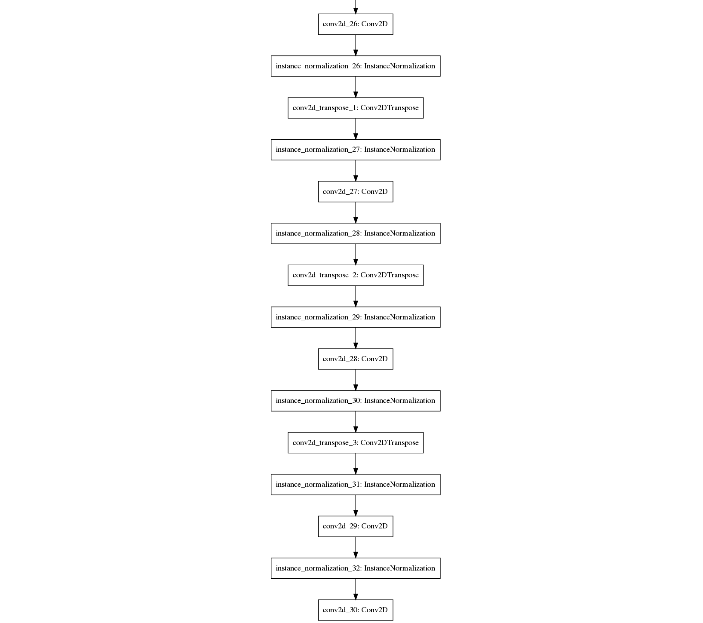

# SANet_in_Keras
> Implement SANet for crowd counting in Keras.

---

## Paper:

+ Original_paper: [_Cao, X., Wang, Z., Zhao, Y., & Su, F. (2018). Scale Aggregation Network for Accurate and Efficient Crowd Counting. *The European Conference on Computer Vision (ECCV)*, 1–17_](http://openaccess.thecvf.com/content_ECCV_2018/html/Xinkun_Cao_Scale_Aggregation_Network_ECCV_2018_paper.html).

+ #### Personal abstraction:

  1. **Network = encoder + decoder**:

     + Encoder and decoder:

       

     |   Network   |           encoder            |       decoder        |
     | :---------: | :--------------------------: | :------------------: |
     | Composition |   scale aggregation module   |   conv2dTranspose    |
     |    Usage    | extract multi-scale features | generate density map |

  2. Loss:

     Loss = }}, \alpha_C=0.001))

  3. Normalization layer:

     + Ease the training process;
     + Reduce 'statistic shift problem'.

### Data:

+ **ShanghaiTech dataset**: [dropbox](<https://www.dropbox.com/s/fipgjqxl7uj8hd5/ShanghaiTech.zip?dl=0>) or [Baidu Disk](<http://pan.baidu.com/s/1nuAYslz>).

### Run:

0. Download dataset;
1. Data generation: run the`generate_datasets.ipynb ` to generate formatted data in the `data/`.
2. Run the `main.ipynb` to train the model and do the test.